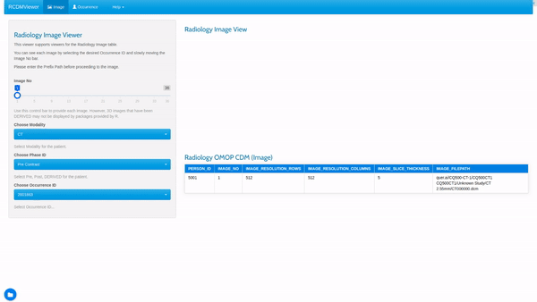

# RCDMViewer

This application is an example application of Radiology CDM.


## Overview

If the original radiological image was a DICOM Viewer, this viewer is a viewer based on the Radiology CDM. The role of seeing radiological images is the same, but based on the OMOP CDM, rather than collecting a lot of metadata in DICOM, we developed only reference to common data of radiological images.

See this link for more information on [RCDM](https://github.com/OHDSI/Radiology-CDM)


## How to install

This application must ETL the current user's radiology image in RCDM format, and this viewer will not work when reading normal radiation image.

Be sure to use RadETL module to convert the radiology image to CDM.

This application is not a package. You can not install it by using the package install command. Be sure to clone it.

```
git clone https://github.com/NEONKID/RCDMViewer.git
```

If Clone is finished, create RDBMS connection information with RCDM in the configuration file named RCDMViewer.cfg. ***If you do not create this file, you will not be able to use the application.***


### Using Host

If you want to distribute RCDMViewer directly to the host, you can distribute it using Shiny Server. But before that you need to install the necessary packages for RCDMViewer.

```bash
Rscript packageManager.R
```

The packageManager.R code is the code that installs these packages.


### Using Docker

The repository contains a Dockerfile with version 3.4.4. RCDMViewer is more than R version 3.4.4, so if you want to use another version, you can modify Dockerfile.

```bash
docker build --tag rcdmviewer:latest .
```

By default, the Shiny server uses port 3838. If you want to distribute it to the outside world, use the following command.

```bash
docker run --name rcdmviewer -d -p 3838:3838 rcdmviewer:latest
```

I recommend using docker-compose. If you want to upload RCDMViewer with a simple command, you can use the above command, but if you want to use log or the like as a storage of host or to put RCDM in container, you have to call several containers.

In general, the web uses 80 ports as the default port, so I connected it to 80 ports.
(See the docker-compose.yml file for details)

```bash
docker-compose up
```


## Preview 




